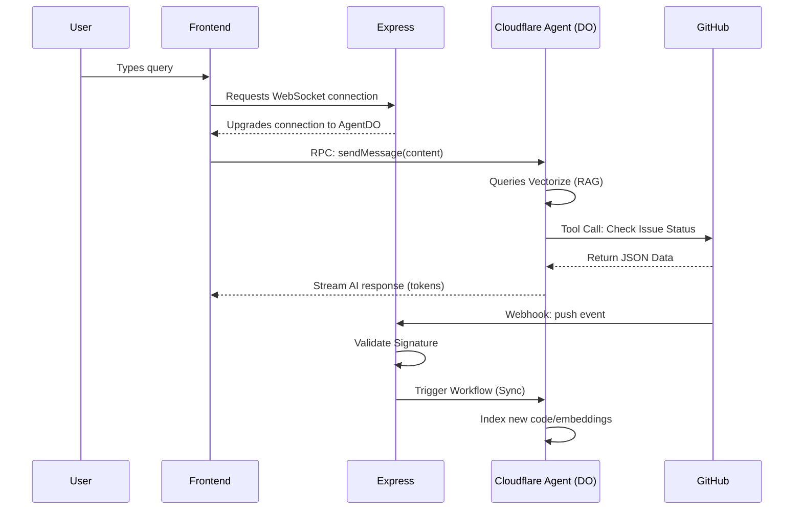

# Gatekeeper AI: API Design Specification

## 1. Overview

Gatekeeper AI utilizes a hybrid API strategy to manage real-time communication between the client, a stateless Express.js gateway, and stateful Cloudflare Agents.

The system prioritizes **type safety** across all boundaries by sharing a `packages/types` directory in the monorepo, ensuring that the Express routes, Next.js frontend, and Cloudflare Agents all speak the same language.

---

## 2. API Architecture Layers

### Layer A: The Gateway API (REST/HTTP)

These endpoints are handled by the **Express.js** service. They focus on authentication, repository management, and initializing sessions.

| Method | Endpoint                                | Description                                              |
| :----- | :-------------------------------------- | :------------------------------------------------------- |
| `GET`  | `/api/v1/auth/github`                   | Initiates GitHub OAuth flow.                             |
| `GET`  | `/api/v1/repositories`                  | Fetches repositories where Gatekeeper is installed.      |
| `GET`  | `/api/v1/repositories/:repoId/sessions` | Lists previous chat sessions for a repository.           |
| `GET`  | `/api/v1/agent/connect/:sessionId`      | Upgrades HTTP connection to WebSocket/SSE for the Agent. |
| `POST` | `/api/v1/webhooks/github`               | Ingress for GitHub webhooks.                             |

### Layer B: The Webhook API (Async Event Processing)

The `/webhooks` endpoint serves as a high-throughput ingestion point.

- **Security:** Every request is validated against the `X-Hub-Signature-256` header using the GitHub Webhook Secret.
- **Async Pattern:** To prevent timeout errors, the Express route:
  1. Validates the signature.
  2. Enqueues the raw payload to **Cloudflare Workflows**.
  3. Returns `202 Accepted` to GitHub immediately.

### Layer C: The Agent RPC (Stateful Streaming)

Because we use the **Cloudflare Agents SDK**, communication with the Agent is performed via RPC calls over a WebSocket/SSE connection, not standard REST.

#### Agent State (`GatekeeperState`)

```typescript
interface GatekeeperState {
  repositoryId: string;
  isThinking: boolean;
  messages: Array<{ role: "user" | "assistant"; content: string }>;
  contextReferences: Array<{ fileName: string; url: string }>;
}
```

#### RPC Methods (`@callable`)

These are defined in the Agent class and invoked directly by the Frontend:

1. `agent.stub.sendMessage(content: string)`: \* **Action:** Sends user prompt $
ightarrow$ Triggers LLM $
ightarrow$ Performs Tool Calls (Vectorize/GitHub API) $
ightarrow$ Streams back tokens.
2. `agent.stub.draftIssue(title: string, body: string, labels: string[])`:
   - **Action:** Bypasses conversational logic to explicitly invoke the issue-creation workflow, returning a GitHub issue URL.

---

## 3. Data Flow Diagram



---

## 4. Implementation Guidelines

- **Shared Types:** All interfaces must reside in `@gatekeeper/types`.
- **Latency:** All API calls that require external data (e.g., querying GitHub) should be routed through the Agent's tools to ensure they benefit from the Agent's cache and context.
- **Error Handling:** Express must log all failed webhook validations to a monitoring service (e.g., Sentry) to ensure we are alerted if GitHub's payload format changes or if the secret is invalidated.
