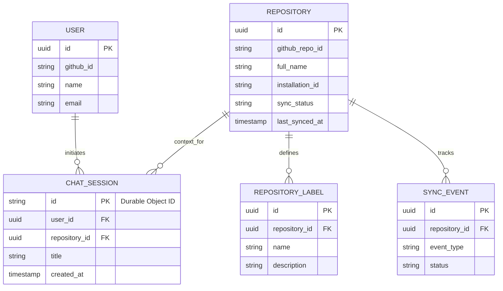

# Gatekeeper AI: Entities & Project Grammar

## 1. Project Grammar (Ubiquitous Language)

To ensure the engineering, product, and design teams are entirely aligned, we define the following "Ubiquitous Language" for Gatekeeper AI. These terms should be used consistently in code (variables, classes), database schemas, and product discussions.

- **Gatekeeper / Agent:** The AI assistant powered by the Cloudflare Agents SDK (running as a Durable Object) that interacts with the user and the repository.
- **Cold Start (Initial Sync):** The heavy, one-time background process that occurs when a repository is first connected. It ingests all code structure, `.github/ISSUE_TEMPLATE` files, and existing issue history.
- **Delta Sync:** The lightweight, event-driven background process triggered by GitHub webhooks (e.g., a `push` to `main` or `issues` event) that updates specific vectors in the database to keep context fresh.
- **Triage Gate:** The validation step where the Agent checks a user's proposed issue against the repository's templates to ensure all required context (logs, OS version) is present before allowing submission.
- **Semantic Duplicate:** An issue that expresses the same bug or feature request as an existing issue, even if the phrasing is completely different.
- **Tool Call:** An autonomous action taken by the Agent to fetch external data (e.g., `fetchLiveIssue()`, `searchCodebase()`).
- **Context Chunk:** A fragment of code or text (typically 500-1000 tokens) that has been parsed, embedded, and stored in the Vector database.

---

## 2. Core Entities (Data Models)

The system relies on a hybrid data model: relational data (stored in Cloudflare D1 or PostgreSQL) for state and metadata, and vector data (stored in Cloudflare Vectorize) for semantic search.

### Relational Entities (Primary DB)

- **`User`**
  - Represents a human interacting with the dashboard.
  - _Fields:_ `id`, `github_id`, `email`, `name`, `avatar_url`, `created_at`.
- **`Repository`**
  - Represents a GitHub repository where the Gatekeeper App is installed.
  - _Fields:_ `id`, `github_repo_id`, `owner`, `name`, `installation_id` (GitHub App), `sync_status` (pending, syncing, synced, failed), `last_synced_at`.
- **`RepositoryLabel`**
  - Stores the ingested taxonomy of a repository.
  - _Fields:_ `id`, `repository_id`, `name`, `description`, `color`.
- **`ChatSession`**
  - Represents a continuous conversation between a User and the Agent regarding a specific Repository. Maps directly to a Cloudflare Durable Object ID.
  - _Fields:_ `id` (matches DO ID), `user_id`, `repository_id`, `title`, `created_at`, `updated_at`.
- **`SyncEvent`**
  - An audit log of webhook events processed by Cloudflare Workflows.
  - _Fields:_ `id`, `repository_id`, `event_type` (push, issue, label), `commit_sha` (optional), `status`, `processed_at`.

### Vector Entities (Vectorize)

- **`VectorDocument`**
  - The embeddings stored in Cloudflare Vectorize. The actual text is often stored in the metadata or a separate KV store to retrieve after a semantic match.
  - _Vector:_ `[0.12, -0.04, ...]` (Float Array)
  - _Metadata:_ \* `repository_id` (Crucial for filtering searches to a specific repo)
    - `type` (Enum: `code_file`, `issue`, `issue_template`)
    - `github_url` (Link back to the source)
    - `content_summary` (Text preview of the chunk)

---

## 3. Entity Relationship Diagram (ERD)

