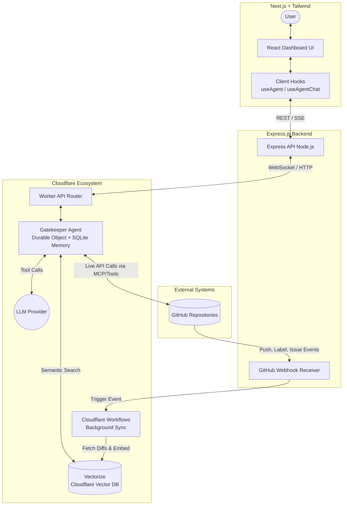

# Gatekeeper AI: System Architecture Document

## 1. Executive Summary
**Gatekeeper AI** is an intelligent, repository-aware GitHub issue management platform. This document outlines the system architecture designed to support a highly responsive, real-time AI chat interface while simultaneously handling computationally heavy, event-driven repository ingestion in the background.

The architecture is built on a unified **Full-TypeScript stack**, leveraging Next.js for the client, Express.js for the API gateway, and the Cloudflare ecosystem (Agents SDK, Workflows, Vectorize) for stateful AI orchestration and background processing.

---

## 2. Technology Stack
* **Frontend:** Next.js (React), Tailwind CSS, Vercel AI SDK
* **API Gateway:** Express.js (Node.js)
* **AI Orchestration:** Cloudflare Agents SDK (Durable Objects)
* **LLM Provider:** Workers AI / OpenAI (via Agents SDK)
* **Vector Database:** Cloudflare Vectorize
* **Relational/Metadata Database:** Cloudflare D1 (Serverless SQLite) or PostgreSQL
* **Background Jobs:** Cloudflare Workflows
* **External Integration:** Native GitHub App (Webhooks & REST/GraphQL API)
* **Language:** TypeScript (End-to-End)

---

## 3. High-Level Architecture

---

## 4. Component Deep Dive & Data Flow

### 4.1 Client Layer (Next.js)
The frontend is a standalone web dashboard providing a split-pane view (Chat on one side, Repository/Issue Context on the other). It communicates with the Express backend using standard HTTP for authentication/metadata and Server-Sent Events (SSE) or WebSockets for streaming AI responses.

### 4.2 Gateway Layer (Express.js)
Acts as the central router and security boundary. 
* **Auth & Routing:** Handles user authentication (GitHub OAuth) and routes chat requests to the Cloudflare Agent.
* **Webhook Ingestion:** Exposes a secure `/webhooks` endpoint for the GitHub App. It validates the GitHub cryptographic signature and instantly acknowledges the payload (HTTP 200) to prevent timeouts, before passing the job to Cloudflare Workflows.

### 4.3 AI Orchestration Layer (Cloudflare Agents SDK)
This is the "Brain" of the system.
* **Stateful Compute (Durable Objects):** Each active conversation or issue-triage session is assigned a specific Agent. Because it's a Durable Object, the Agent natively stores chat history and local state in an embedded SQLite database without needing constant read/writes to an external DB.
* **Tool Calling:** The Agent is equipped with TypeScript `@callable()` tools to search the vector database (`Vectorize`) for codebase context, or query the live GitHub API for real-time issue states.

### 4.4 Background Ingestion (Cloudflare Workflows)
When Express receives a `push` webhook, it triggers a Workflow. Workflows are durable, step-based background jobs that handle retries automatically. The Workflow will:
1. Fetch the git diff from GitHub.
2. Chunk the new/changed code or markdown.
3. Call an embedding model (e.g., `text-embedding-ada-002` or BGE-m3).
4. Upsert the vectors into **Cloudflare Vectorize**.

---

## 5. Architectural Decisions & Trade-offs

### Decision 1: Full TypeScript Stack vs. Python (FastAPI/LangChain)

- **The Choice:** We opted for TypeScript across the entire stack (Next.js, Express, Cloudflare) instead of a mixed Node/Python stack.
- **Pros:** \* Massive developer velocity. We can use a monorepo (e.g., Turborepo) and share Zod schemas, types, and interfaces (`GithubIssue`, `RepoContext`) directly between the frontend UI, the Express backend, and the AI Agent.
  - Reduced context switching for developers.
- **Cons (Trade-offs):** \* The Python ecosystem for AI (LangChain, LlamaIndex, chunking libraries) is significantly more mature than the JavaScript/TypeScript ecosystem. We may need to write custom logic for complex text chunking or markdown parsing that comes out-of-the-box in Python.

### Decision 2: Cloudflare Agents (Durable Objects) vs. Stateless API + Redis

- **The Choice:** Using Cloudflare Agents SDK for orchestration rather than standard stateless Express endpoints backed by Redis for memory.
- **Pros:** \* Simplifies state management. Durable objects inherently remember chat history and context without manual database querying per message.
  - Built-in WebSockets and streaming make real-time chat much easier to implement.
  - Eliminates the need to manage standalone Redis clusters or Celery workers.
- **Cons (Trade-offs):** \* **Vendor Lock-in:** Durable Objects and the Agents SDK are highly specific to Cloudflare. Migrating the AI orchestration layer to AWS or GCP in the future would require a significant rewrite.
  - Local development can be slightly more complex when mocking Durable Objects compared to a standard local Node server.

### Decision 3: Express.js Gateway vs. Direct-to-Worker Edge API

- **The Choice:** Keeping Express.js as an intermediary API rather than having the Next.js app talk directly to Cloudflare Workers.
- **Pros:** \* Express acts as a robust, traditional backend for handling complex GitHub App webhook validations, OAuth flows, and potential rate-limiting logic.
  - Allows easier integration with standard Node.js middleware.
- **Cons (Trade-offs):** \* Introduces an extra network hop (Next.js -> Express -> Cloudflare -> Express -> Next.js) which adds slight latency compared to an Edge-only architecture.
